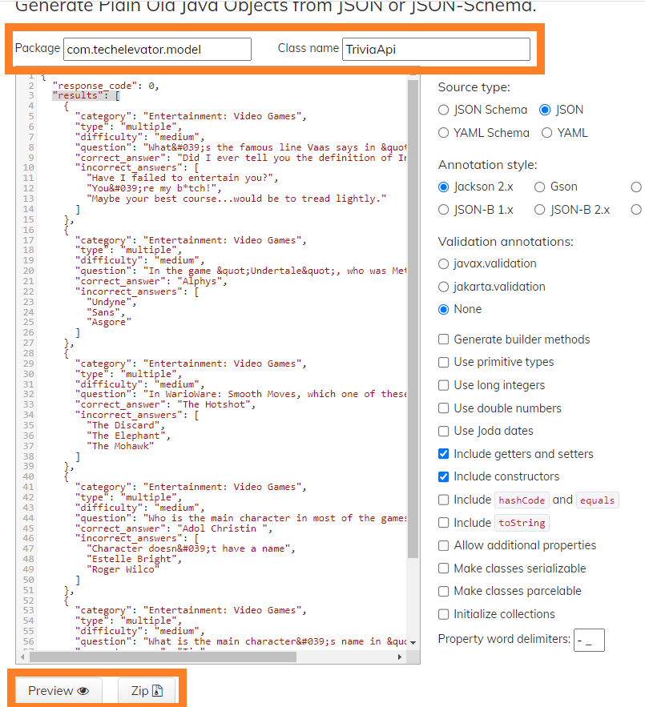

# QuizMaker with DAO
This version of QuizMaker includes 3 DAO implementations:
 * one for reading from text files
 * one for reading from a database.
 * one for reading from an API, [Open Trivia API](https://opentdb.com/api_config.php)

Which one depends on what the user selects.

To set up the database, create a new database in pgAdmin called QuizMaker.
Then open a query window and run the `quiz_db.sql` file from the /database folder of this project.

    ApiQuizQuestionDao  - class that reads from the Open Trivia Api
    JdbcQuizQuestionDao - class that sends SQL commands using the JdbcTemplate class.
    FileQuizQuestionDao - class that reads quiz questions from a text file 
    QuizQuestionDao     - Dao interface that is implemented by ApiQuizQuestionDao, JdbcQuizQuestionDao, and FileQuizQuestionDao  

After starting the program, select where to load the quiz questions from.
The File and Database sources are completed, but **the API is not**.
Afterwards, select a quiz number and the corresponding quiz will be loaded.

## Miscellaneous

The model classes used in this starter code were generated from [jsonschema2pojo.org](https://www.jsonschema2pojo.org/) with the following settings:

